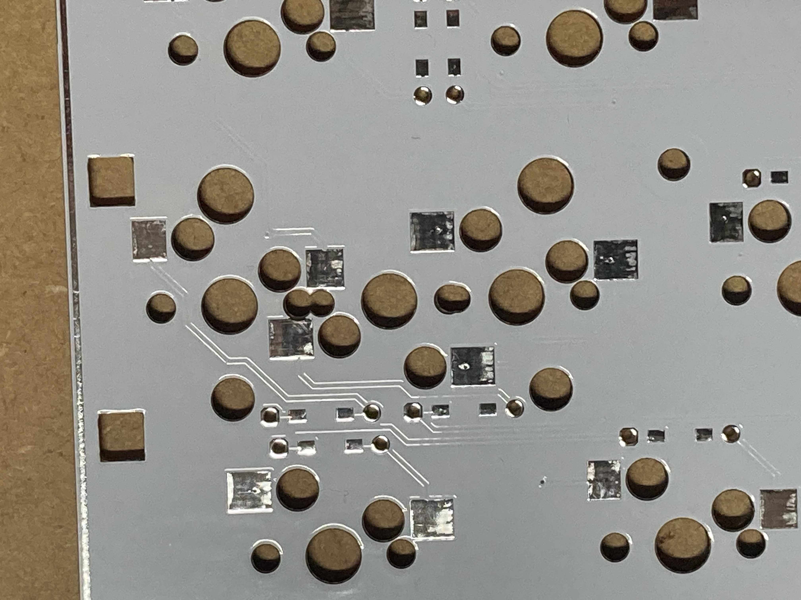

# Beta版 ビルドガイド

## 作業前の準備
### 必須パーツ
販路やイベントにより販売時の内容は異なります。足りないものをそれぞれ揃えてください。
 - 基板  
   1枚  
   「75% JIS Row Staggered Keyboard "Constant Moderato"」と、バージョン情報が書き込まれた面が裏側となります。  
   ビルドガイド内で左右が指定されている場合は、この文字がきちんと読める方向に合わせてください。
 - スイッチプレート  
   1枚  
   裏表を判別するマーク等はありません。スイッチの位置を合わせてください。  
 - バックプレート  
   1枚  
   リバーシブルです。好きなデザインでどうぞ。
 - ゴム足  
   同形状のものが4つ入っています。  
   傾斜を付けたい場合は適切なものを購入してください。  
 - ネジ  
   M2×3、M2×7を7本ずつ使用します。  
   短い方、長い方と判別してください。
 - スペーサー  
   M2×2mm、M2×3.5mmを7本ずつ使用します。  
   厚い方、薄い方と判別してください。
 - 作業用ピンヘッダ  
   短いもので問題ありません。2本ほど必要です。  
 - Waveshare RP2040-Zeroまたは互換基板  
   1個
 - Cherry MX互換キースイッチ  
   87個
 - MX軸キーキャップ  
   1セット JIS配列推奨  
   ※「キーキャップの選定」参照
 - MXキーソケット  
   88個 Kailh製のものを想定しています。
 - ダイオード  
   87個 1N4148シリーズ 表面実装タイプ
 - MX用 スタビライザー  
   1～3個 PCBマウントタイプ
   ※「キーキャップの選定」参照

### LED実装時のオプションパーツ類
 - LED SK6812MINI-E  
   左右のみ光らせたい場合：12個  
   下のみ光らせたい場合：14個  
   左右と下の全部を光らせたい場合：26個  
   ※後から光るLEDの個数を調整可能なので、特にこれと決めていなければ最大数の実装がおすすめです
 - ダイオード 1N4148  
   左右を光らせたい場合：1個  
   下を光らせたい場合：1個  
   両方光らせたい場合：2個  
   ※後から光るLEDの個数を調整可能なので、特にこれと決めていなければ最大数の実装がおすすめです
 - コンスルー  
   LEDを実装する際は、通電確認に使うと楽です。実装に使用するわけではありません。
   
### 必須工具類
 - はんだ作業関連品一式  
 - USB TypeC通信用ケーブル  
### 推奨工具類
 - はんだ作業用マット  
   はんだ面の中にビア(導電のための貫通穴)を設けてあるため、稀にここを通って裏にフラックスが回る場合があります。  
   机を汚したくない場合は敷くといいでしょう。
 - ゲタ  
   便宜上ゲタと呼んでいますがスルーホールパーツなどを実装する際に基板の下に敷いて高さを稼ぎ、パーツの浮きを防ぐためのものです。  
   非導電性で厚さ3mmほどあればいいので、割りばしなどを折ったもので構いません。  
 - キープラー
 - 油性マーカー(白)  
 - マスキングテープ  
### 必要ファイルのダウンロード
 - constant_moderato-****.uf2  
   ファームウェアです。ハイフン以降がバージョン情報となり、基本的に最新のものが利用できます。  
   ※稀に特殊な用途のファームウェアがあるので、使用前にビルドガイドを確認し、分からないものは使わないでください。  
 - [Vial](https://get.vial.today/)  
   キーマップを書き換えるためのソフトウェアです。  
   オンライン版でも問題なく利用できますが、ダウンロード版だと日本語表示、JISキーに対応していることと、マトリクスチェッカーの反応が早くて良いのでお勧めです。
  
## キーキャップの選定
以下の条件を満たすセットであれば主要なキーをカバーできます。  
 - 75%以上のセット  
 - JIS配列対応  
   
100%のキットであればほぼ完璧にカバー可能ですが、最下段のキー幅によっては個別購入が必要になります。  
最下段の構成は以下の通りです。
- 1.25u Ctrl
- 1.25u Win
- 1.25u Alt
- 1.5uまたは1.25u 無変換
- 2.75uまたは3u Space
- 1.5uまたは1.25u 変換
- 1.25u カナ
- 1.25u Menu
- 1.25u Ctrl
- 十字キー

このキーボードを特徴づける要素として、キー幅の複数対応があります。例えば、左Shift(2.25u)は、1u Fnと1.25u Shiftに分割可能です。  
また、1.5uの無変換・変換と2.75u Spaceを組み合わせたり、1.25uの無変換・変換に3u Spaceを組み合わせることができます。    
好みとセットの内容に合わせて調整してください。  
おすすめはSpaceを2.75u、無変換・変換を1.5uにすることです。この幅だとキーの隙間が一定になります。  
3u Space用に3uのスタビライザーも実装可能です。
  
その他のキーも足りない場合は適宜単品購入して合わせます。  

[具体的なキー幅はKLEでも確認できます。](https://www.keyboard-layout-editor.com/##@@=0,0&_x:0.75%3B&=0,2&=0,3&=0,4&=0,5&=0,6&=0,7&_x:1.25%3B&=6,1&=6,2&=6,3&=6,4&=6,5&=6,6&_x:0.75%3B&=6,7%3B&@_y:0.25%3B&=1,0&=1,1&=1,2&=1,3&=1,4&=1,5&=1,6&=1,7&=7,0&=7,1&=7,2&=7,3&=7,4&=7,5&=7,6&_x:0.75%3B&=7,7%3B&@_w:1.5%3B&=2,0&=2,1&=2,2&=2,3&=2,4&=2,5&=2,6&=2,7&=8,0&=8,1&=8,2&=8,3&=8,4&_x:0.25&w:1.25&h:2&w2:1.5&h2:1&x2:-0.25%3B&=8,6&_x:0.75%3B&=8,7%3B&@_w:1.75%3B&=3,0&=3,1&=3,2&=3,3&=3,4&=3,5&=3,6&=3,7&=9,0&=9,1&=9,2&=9,3&=9,4&_x:2%3B&=9,7%3B&@=4,0%0A%0A%0A0,0&_w:1.25%3B&=4,1%0A%0A%0A0,0&=4,2&=4,3&=4,4&=4,5&=4,6&=4,7&=10,0&=10,1&=10,2&=10,3&=10,4&_w:1.25%3B&=10,5&_x:1.25%3B&=10,7%3B&@_y:-0.875&x:14.625%3B&=10,6%3B&@_y:-0.125&w:1.25%3B&=5,0&_w:1.25%3B&=5,1&_w:1.25%3B&=5,2&_x:6&w:1.25%3B&=11,2&_w:1.25%3B&=11,3&_w:1.25%3B&=11,4%3B&@_y:-0.875&x:3.88&w:1.5%3B&=5,4%0A%0A%0A1,0&_w:2.75%3B&=5,6%0A%0A%0A1,0&_w:1.5%3B&=11,0%0A%0A%0A1,0&_x:3.995000000000001%3B&=11,5&=11,6&=11,7%3B&@_y:0.125&w:2.25%3B&=4,1%0A%0A%0A0,1&_x:1.75&w:1.25%3B&=5,4%0A%0A%0A1,1&_w:3%3B&=5,6%0A%0A%0A1,1&_w:1.25%3B&=11,0%0A%0A%0A1,1)  

## ファイルの確認
ファイル名末尾の **** の部分はバージョン情報や特殊なファームウェアに関する情報です。基板のバージョンとファームウェアのバージョンには関連がありませんので、Ver.BETAを除いては特別な理由がない限り最新のものを使用してください。  
全て本リポジトリ内の/Firm/Ver-****/以下で入手できます。  
### constant_moderato-beta-****.uf2
キーボードを制御するためのファームウェアです。   
末尾がallのものはLEDをすべて(左右と下)光らせるとき、sideは左右のみ、downは下のみ光らせるときに使うものになっています。  
※LEDの実装場所とファームウェアの種類が合わない場合、LEDの光り方にインターバルができたり、光らない部分ができたりする可能性があります。

### Vial
[Vial公式](https://get.vial.today/)からダウンロードできる、リアルタイムでキーボードの設定を変更できるソフトウェアです。  
日本語配列への表示変更が可能で認識の早いダウンロード版をおすすめしますが、Web版でも問題なく使用できます。  

## RP2040-Zeroの作業
### 動作確認
BOOTボタンを押しながらPCとRP2040-Zeroを接続し、ストレージとして認識されたら.uf2ファイルをコピーします。  
書き込みが終わった段階でストレージとして認識されなくなり、かわりにHIDデバイスとして接続されるはずです。  
一旦書き込んだらVialの使用が可能になるので、Vialを起動し、キーボードが表示されていることを確認します。  

うまくいかない場合
  
通信用ケーブルで接続していることを確認してください。  
 
稀にPC側のポート自体が破損していて通電していてもデータ通信が行えないこともあります。(一敗)  
PCに接続してから「BOOTボタンを押しながら、RESETボタンを押す」という方法でも接続が可能です。  
   
  それでも認識しなかったり、書き込めない場合は初期不良かもしれません。

  

## はんだ前の作業

### 基板端の処理(任意)
尖った部分がある場合はヤスリで削ります。  
基板の端(断面)をマーカーで塗ると綺麗に見えます。  
あとでフラックスクリーナーを使う場合はクリーニングの後に塗りましょう。

### RP2040-Zeroの塗装(任意)
ボタン部と端子のある辺の基板端を塗ると組み立てた後も目立たなくなります。  
あとでフラックスクリーナーを使う場合はクリーニングの後に塗りましょう。

### ロゴと文字の保護(任意)
文字や基板外周の線ははんだ面で表示しているため、はんだやフラックスが付くと汚れてしまいます。  
心配な場合は、マスキングテープやカプトンテープを貼り付けておき、はんだ作業が終わった時点で剥がすといいでしょう。  

はんだ付いちゃった……
一応剥がす手段があります。  

- まず、はんだが付いた部分にさらにはんだを多めに盛る。
- 一度固めて、フラックスを塗り、はんだ回収線を載せる。
- 強めに加熱して一気に吸収する。
- フラックスリムーバーやパーツクリーナーで汚れを洗浄する。

  多少の凹凸は残りますが、いい感じに平らにできます。  
  製造段階では基本的に有鉛ハンダを使用しているため、この作業を行う際も有鉛ハンダをお勧めします。  
  流動性が良いので、回収しやすく凹凸が減り、なおかつ有鉛無鉛を混合することによる強度低下や融点の上昇を抑えることができます。  

## 部品のはんだづけ
ここから先は大量のパーツをはんだづけすることになります。  
途中で休憩もできますが、一度にやってしまうのが楽でしょう。  

### LEDと周辺のはんだづけ(任意)
LEDをはめこむ穴の周りのはんだ面の角が欠けている部分にLED側の足の角が欠けている部分を合わせると正しい方向になります。  
発光面は基板オモテ側を向くようになります。丸い透明な樹脂がはまっている面が発光面です。  

左右のみ光らせるという場合は左右だけ配置してもいいです。上から6個ずつ合計12個実装してください。
下のみの光らせる場合は45°に傾いたLEDと、それに挟まれた12個の合計14個を実装します。  
全部光らせたい場合は(当然)26個すべてを実装してください。

基板裏面を正面から見て左側のダイオードをはんだづけします。  
左右だけ光らせる場合は下のダイオードを、下だけ光らせる場合は上を実装します。全部光らせる場合は両方実装します。  

この際、1N4148シリーズを使用するなら基板ウラで問題ありませんが、1N4007など直径2mmを超えるリードダイオードに関しては基板オモテに実装してください。  
※ここで1N4007が必要になる状況は極めて稀なため、同梱していませんが、秋月電子などで一般的に手に入ります。入手が難しい場合は相談の上で私から送ることもできます。連絡してください。

基板オモテ面のジャンパーをはんだ付けします。
以下の画像を参考に実装してください。  

基板右上の4か所は、
- 左右と下を光らせたい場合、上の3つ
- 左右だけを光らせたい場合、中央の2つ
- 下だけを光らせたい場合、一番上、一番下の2つ  

を接続します。

基板右下の1つは、左右と下を光らせたい場合に接続します。  
下を光らせない場合、下だけ光らせたい場合は接続不要です。

基板左下の2つは、
- 左右と下を光らせたい場合、左
- 左右だけを光らせたい場合、右

を接続します。下だけ光らせたい場合は接続不要です。

一部ライティングはLEDの実装数を元にエフェクトの周期を決定しています。これ以降はファームウェア側で認識するLEDの数とハードウェア的なLEDの数を合わせる必要があるため、左右のみ光らせる場合はファームウェア名の末尾がsideのもの、下のみの場合はdown、左右と下を光らせる場合はallを選んで書きこむようにしてください。

LEDが正しくはんだづけできているか不安…
コンスルーを使用し、基板とMCUを接続してみてください。または、後述の方法でMCUをはんだ付けしてください。
  
問題なくはんだ付けできれていれば、通電すると赤色に光るはずです。この状態でVialを使用し、Backlightingのタブから色やアニメーションを切り替えましょう。  

問題なく接続できているなら、なめらかに切り替わりますが、接続が不安定だと、その部分から先のLEDは不安定になります。

### トラブルシューティング(1)

LEDがすべて光らない
ダイオード、LED、5V0、GND、GP29が問題なく接続できているか確認してください。また、ケーブルが断線していないか確認し、Vialを使用してBacklightingのタブからLEDの光らせ方を色々変更してみてください。
  

LEDが途中から光らない・ちらつく
光らない/ちらつくLED自体のはんだづけと、1個前のLEDのはんだまたはジャンパーを確認してください。

LEDがしばらく光った後に光らなくなった
一度キーボードを接続しなおし、VialのLED制御を用いて光量(Brightness)を最大値の半分～1/3程度まで下げてSaveします。ここまでで光れば問題ありません(スリープモードなどによる消灯だと思います)。  

この状態でなお光らない場合はケーブルを外してLED用ダイオードを交換し、再度通電させてみてください。これで治る場合は、ダイオードの接続が甘かったか、過熱によりダイオードが破壊されていた可能性が高いです。一般整流ダイオード1N4007などに交換してください。これは同梱されていませんが、秋月電子などで一般的に手に入ります。  

Vialがエラーを吐く
ケーブルの接続を再度確認し、PCにキーボードが接続された状態でVialを再起動するか、Refreshボタンを押してみてください。うまくいかない場合は再度ファームウェアを書きこんでみることと、LEDのはんだ付けを確認してください。

それ以外の問題・治らない場合・わからない場合
製作者に連絡してください。

  
### ダイオードのはんだづけ
1N4148シリーズの使用を想定しています。**配線最適化と破損防止のため、向きを統一していません**  
ダイオード表面の線やマーカーが、8角形のパッドのついた穴に来ます。よく観察して実装してください。  

高さが2mmを超えるとバックプレートと干渉するため注意してください。  
また、あまり曲がった状態に固定するとスイッチソケットと干渉するおそれがあります。  
  
ダイオードのはんだづけに不安がある場合はここで導通確認を行います。  
MCUをコンスルー(スプリングヘッダ)で接続するか、後述の方法ではんだ付けしてしまい、スイッチソケットのパッドにワイヤーやピンセットを当てて反応を確認してください。
VialのMatrix Testerを起動し、スイッチのパッドにピンセットやワイヤーを当てて導通させます。 
  
すべてのキーに対応する位置が間違いなく反応している状態であれば問題ありません。  
そうでない場合、ダイオードの向きが間違っているか、ダイオードの導通が取れていないか、MCUの接続に問題があるので、それぞれ接続を確認してください。　　
なお、左Shiftが実際に実装したい数と異なる場合はVialのLayoutsタブを開き、Left Shift Divisionのドロップボックスから変更してください。

### スイッチソケットのはんだづけ
パッドと穴の位置を宛にしてはめこみ、はんだづけしてください。大きい穴に干渉しない方向で実装します。    
あまり大量にはんだを流すと端子部だけでなくソケット部にまで流れ込み、押し込みが硬くなったり、導通しなくなってしまうので注意してください。  
クリアランスが0.2±0.1mmに設定されているため、浮きがあるとバックパネルが取り付けられなくなります。基板に密着していることを確認しながらはんだづけしてください。  
#### Shiftの処理
左Shiftキーは分割可能になっており、ソケット(と、スタビライザー)も分割に応じて必要なものが変わります。  

2.25u Shiftにする場合は中央のみ実装すれば良いです。  
1u Fnと1.25u Shiftにする場合は左右を実装し、中央は不要です。  
両方対応するために全部実装してもいいです。  

スタビライザーはちょうどネジや爪が避けるようになります。

かなりぎりぎりですが、良い感じになります。
### Enterの処理
Enterキーのソケットのみ、縦横を選択可能になっています。  
  
特にこだわりがない場合はスイッチが横向き(ソケットが縦長)になるようにしてください。  
  
一部のキーキャップではスイッチの方向が違うと挿入できないため、必要に応じてスイッチを縦向き(ソケットは横長)になるように配置しなおします。
  
もし事前にチェックしたい場合、エンターキーの中央の足にスイッチを刺してみて、足がどの位置に来るかを確認しましょう。普通は軽く押し込めば入るはずですが、あまりにも入らないときは90度回転させて再度押し込んでみます。  
どちらかはすんなり入るはずなので、この向きに合わせてソケットをはんだ付けします。  
なお、基板の穴の精度によってはソケット自体がが基板に入らないことがありますが、少し強めに押し込んでも大丈夫です。

### RP2040-Zeroのはんだづけ
RP2040を基板のオモテ側に載せ、端子のある面がウラ側に向くようにします。  
この状態で付属のピンヘッダやコンスルーを突き刺し、RP2040が動かないようにして、ピンヘッダを刺している場所以外の端面スルーホールをはんだづけしていきます。  

ピンヘッダにははんだづけを行わず、RP2040が軽く固定できた時点で抜いて、残りの端面スルーホールもはんだづけしてください。  

実際に使っているピンはどれ？
マトリクススキャンはGP0～13、LED DOUTにGP29、LED用動力線の5V0、GNDです。
  
LEDを実装している場合、MCUに通電すれば赤色に発光するはずです。

### 導通確認
Matrix Testerを使用し、以下の方法のいずれかで基板の導通を確認します。  
- スイッチをはめ、押してみて反応を見る。
- はんだ付けしたソケットの脚にピンセットやワイヤーをあてて導通させる。  
  
すべてのキーが間違いなく反応している状態であれば問題ありません。  
そうでない場合、ダイオードの向きが間違っているか、ダイオードの導通が取れていないか、MCUの接続に問題があるので、それぞれ接続を確認してください。  
なお、左Shiftが実際に実装したい数と異なる場合はVialのLayoutsタブを開き、Left Shift Divisionのドロップボックスから変更してください。

うまくいかない場合はトラブルシューティング(2)を確認して対応してください。

### トラブルシューティング(2)

キーが反応しない・別のキーが反応する(1個単位)
ダイオードの方向、ソケットのはんだを確認してください。スイッチ自体の導通も見ましょう。  

※はんだ部分はヤニでコーティングされるため、ピンセットを強く押し当てないと通電しないことがあります

行・列単位でキーが反応しない・たくさん反応する
MCUのはんだ不良を疑います。
ピンとパッドが問題なく接続されていること、周辺のパッドと短絡していないことを確認してください。

勝手に反応する
はんだの短絡を疑います。多すぎる場所から適宜回収してください。

稀に外部からのノイズで発生することもあるため、通信機器から少し離すなどもしてみてください。

それ以外の問題・治らない場合・わからない場合
製作者に連絡してください。

## 組み立て
### スタビライザーの静音化(任意)
スタビライザーを分解して摺動部とワイヤーの端をたっぷりのグリスでコーティングします。  
左Shift、Enter、Spaceのスイッチの左右、スタビライザーの足元(穴と穴のあいだ)に静音パッドを貼ります。ない場合はマスキングテープや不織布テープ、絆創膏の粘着部を切って貼ります。  
左ShiftはFn+Shiftにする場合は静音パッド等は不要です。 
テープの枚数は基板との隙間によりけり。多すぎると固定用の爪が噛まなくなるので適度にゲタを履かせましょう。  

### スタビライザーの取付け
左Shift、Enter、Spaceのスイッチの左右に大きい穴と小さい穴の組み合わせがあります。大きい穴にスタビライザーの片爪を掛け、小さい穴に両爪やメネジの部分を押し込んでください。  
左ShiftはFn+Shiftにする場合はスタビライザーは不要です。

### 組み付け
まずバックパネルの外側にしたい面から7mmのネジ(長い方)を通し、2mmのスペーサー(薄い方)で固定します。  
スぺーサーの上に基板を重ねます。  
組み付けの精度によってはすんなり入りませんが、抵抗があって少し擦る程度は想定の範囲内なのでバチッと嵌めて組んでください。  
基板から飛び出したネジに3.5mmスペーサー(厚い方)を留め、スイッチプレートを乗せて3mmネジ(短い方)で固定します。  
ゴム足は文字やマークを避けるように適宜貼り付けてください。  

### スイッチ・キーキャップの実装
好みのスイッチとキーキャップを実装してください。  
一般的なMX互換スイッチ・キーキャップであれば使用できます。  

# マッピングガイド
キーマップの書き換えにはVialを使用します。ダウンロード版の方は日本語配列にも対応しており、マトリクステスターの反応も早いため使いやすいと思います。  

## 初期状態
デフォルトで設定されているのは一般的にJIS配列と呼ばれるものそのものです。  

## 書き換え
キーボードをPCに接続し、Vialを起動し、表示されたキーから変更したいものを選ぶ→画面下のリストからキーコードを選ぶ  
という手順で書き換えが可能です。  
タップダンスやコンボなど、詳細な使用方法はVialの公式ドキュメントなどを参照してください。

# カスタムガイド
## おすすめキースイッチ
サンドイッチマウントとしては剛性がかなり高くなっています。  
場所による癖が少なく、全体に亘って硬めの打鍵感となっているため、打鍵感を柔らかくしたい場合はサイレントスイッチを採用するのがおすすめです。 
## フォームシート等について
スイッチプレート、基板、バックパネルの距離をスペーサーで厳密に固定しているため、フォームシートを利用しても効果が感じづらい可能性が高いです。  
従って、ソケットやダイオードなどに合わせて穴を開けたタイプのフォームシートに対応する予定もありません。ご了承ください。  
## おすすめキーキャップ
Acid Capsシリーズを使用するとほとんどのレジェンドを合わせることができます。  
論理配列は通常の75%JISキーボードに近いため、手が覚えているなら無刻印キーキャップでも問題なく使用可能かと思います。  
現行品ではキーソケットの方向を逆方向に揃えているため、CherryプロファイルとMXスイッチの組み合わせでは干渉することがあります。 
## LEDが光る数を変える
ビルドガイドの「LEDと周辺のはんだ付け」の章を参照し、ジャンパーを接続します。  
この時、使用しないジャンパーははんだ吸い取り線や吸入器で導通を切るようにしてください。  
ダイオードやLEDを外す必要はありません。  
光らせたい位置に合ったファームウェアを書きこみなおせば変更完了です。(左右→末尾がside 下→末尾がdown 全部→末尾がall)  
※ファームウェアを書きこみなおすとキーマップが消えることがあるので、先に保存しましょう

## ファームウェアの改造
[ここにあります。](https://github.com/Cheena-gb/vial-qmk/tree/vial/keyboards/cheena/constant_moderato)  
改造ファームの不具合、それに起因する故障などについてはサポートできませんのでご了承ください。  
また、DefaultとVIA用のキーマップには作業を行っていないため動きません。

